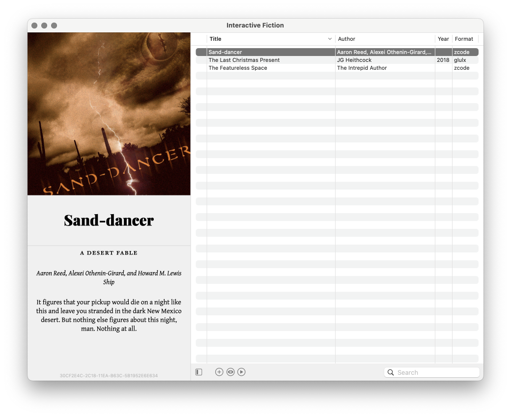
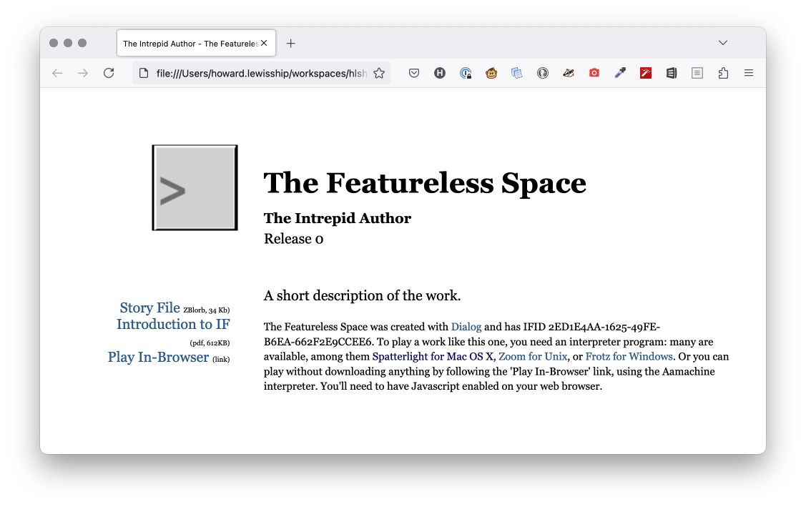

# dgt - Dialog Tool

> dgt 2.0 is a total rewrite and is currently in progress

`dgt` is a tool to assist in the development of interactive fiction
written in the [Dialog](https://linusakesson.net/dialog/index.php) language. Not every work of IF is a "game" so we use the term "project".

`dgt` simplifies Dialog development, it allows you to specify the details of your project,
including what individual source files to use, and then provides commands to:

- run your project in the Dialog debugger
- run the web-based Skein UI
- run tests derived from your skein files
- package your project for release

Unlike many of my projects, this is _really_ for personal use:

- OS X only
- Subject to breaking change at any time
- Written in [Babashka](https://github.com/babashka/babashka) (the ultimate scripting language) which you almost certainly don't know

## Installing

Dialog tool is easily installed on OS X using the [Homebrew](https://brew.sh/).

```
brew install hlship/brew/dialog-tool
```

This will download and install the `dgt` command, along with all it's dependencies.

Run the command `dgt help` for a list of commands; each command has a `--help` option (abbreviated as `-h`) that gives
specific details.

> The first time you run `dgt` it may have to download additional libraries, which takes a second or two. Subsequently, `dgt` starts lightning fast.

## Creating a new project

The command `dgt new` creates a new directory and a new project within it:

```
> dgt new magnum-opus
Creating magnum-opus ...
  dialog.edn
  src/meta.dg
  src/magnum-opus.dg
  lib/dialog/stdlib.dg
  lib/dialog/debug/stddebug.dg
  cover.png
  bundle/index.html
  bundle/play.css
  bundle/style.css
  
Change to directory magnum-opus to begin work
dgt debug to run the project in the Dialog debugger
dgt new-skein to open a web browser to the Skein UI
dgt help for other options
```

The exact files created by `dgt new` may change over time.

The directory must not already exist.

`dgt new` will create a unique [IFID](https://linusakesson.net/dialog/docs/beyondprg.html) for your project; it
will be part of the content in the `meta.dg` file. 

## dialog.edn

Your project must have a `dialog.edn` file at the root.

> [EDN (Extensible Data Notation)](https://github.com/edn-format/edn) is like JSON on steroids. It's the natural
  choice for Clojure programmers, but it's close enough to JSON that you should be able to figure it out.

This file identifies the sources in your project as well as other details needed to build, debug, and test your project.

A minimal example `dialog.edn` (as created by `dgt new`):
 
```
{:name "magnum-opus"
 :format :zblorb
 :build
 {:zblorb
  {:options ["--cover"     "cover.png" 
             "--cover-alt" "Magnum-opus"]}}
 :sources
 {:main    ["src"]
  :debug   ["lib/dialog/debug"]
  :library ["lib/dialog"]}}
```                   

### Source Paths

The primary (but not only) use of `dialog.edn` is to tell `dgt` where the sources for your project are,
and _in what order_ they should apply (which is very critical to how Dialog operates).
Further, during development and testing you will often include extra "debug" sources that should not 
be included when building and packaging your project for release.

`dgt` uses three sets of sources.  For each set, you may specify a number of directories, relative
to your project, in which to locate source files. All Dialog source files _directly_ in each directory
are included.

* :main - sources specific to your project
* :debug - used by the commands `test`, `debug`, `skein`, etc.
* :library - additional libraries, including the Dialog standard library

Generally, source code that is specific to your project goes in :main; reusable code goes in :library and :debug; 
this may include code obtained from others, including the standard library.

It is a common practice to modify libraries as necessary, even the standard library!  Another
good practice is to try and split out reusable code (code that could reasonably be used in an entirely different
project) under :library (and :debug).

### Format

The :format key defines the output when the project is built; :zblorb is a good general choice.
In specific situations you may want to build for :z5, :z8, or :aa.  The differences between
these formats are described in [the Dialog manual](https://dialog-if.github.io/manual/dialog/1a01/software.html).

### Build Config

The :build key contains build configuration for each format. When bundling, you may build once according
to the project's format, and a second time in :aa format for the web.

The :options key is used to specify additional options to add to the `dialogc` command line.
This is typically used to set the heap size information.

Under :build, the :default key contains defaults for building (any format); the specific build map (:zblorb, in our example)
is merged on top of the :default map, if present.

## Running your project

`dgt debug` will run your project using `dgdebug` so you can explore your creation interactively at the console.

```
> dgt debug
Dialog Interactive Debugger (dgdebug) version 0m/03.
Type @help at the game prompt for a brief introduction.


The Featureless Space
An interactive fiction by The Intrepid Author.
Release 0. Serial number DEBUG.
Dialog Interactive Debugger (dgdebug) version 0m/03. Library version 0.46.
Debugging extension 1.1.

Endless Featureless Space
You are in an endless, featureless space. Just what will you create within it?

>
```

Again, the title, author, release number, and other details can be configured by editing `meta.dg`.
The file `magnum-opus.dg` contains the room and player and not anything else.  From here, it is all about
your imagination.

However, you are likely to spend very little time directly running the debugger; instead, you'll run the debugger indirectly, via the Skein.

You can also run your project using [frotz](https://gitlab.com/DavidGriffith/frotz) with `dgt run`.  
This will compile your project first.
By default, debug sources are excluded, but you can run with the `--debug` switch to include them as well.

Neither the debugger nor the Skein can present all the possible Dialog screen effects, such
as status bar updates; to verify these, you must run using Frotz.

## Running the Skein

The [Skein](doc/skein.md) is an interactive web interface for running, debugging, and
testing your project.

`dgt new-skein` will open up the skein UI for a new skein file.  
By default, the file is named `default.skein`, or you can provide a different
name, as you may want to have multiple skein files. 

The Skein UI is an alternate way of running your project in the Dialog debugger; you interact through
a web-based user interface.

The Skein represents your project as a tree of "knots"; each knot is a command. You can
add new commands beneath any knot, and you can also rerun the project to any knot
and the skein will identify any text that has changed.  You can even run *all* possible branches
to completion.

`dgt skein` will open an existing skein.

## Building and Bundling

The `dgt build` command is used to build your project; the :format key of `dialog.edn` determines how it
will be built; the default is :zblorb; The [ZBlorb format](https://en.wikipedia.org/wiki/Blorb) can contain not only the compiled output of your project, but
also sounds and images.

```
> dgt build
Building out/release/magnum-opus.zblorb ...
```

ZBlorb files also include a cover image; the file `cover.png` is used for this.  A boring placeholder `cover.png` is
created by `dgt new`.

This image can be used by an application that runs your compiled project,
such as [Spatterlight](https://github.com/angstsmurf/spatterlight):



You can see that some of the game's metadata is also presented, such as the title, and the "blurb". This is all customized in the `meta.dg` file.

You can upload your zblorb file to the [Interactive Fiction Database](https://ifdb.org/).
If you want to self-host your project, you can bundle it:

```
> dgt bundle
Building out/release/magnum-opus.zblorb ...
Building out/release/magnum-opus.aastory ...
  out/web/resources/...
  out/web/resources/style.css
  out/web/introduction-to-if.pdf
  out/web/style.css
  out/web/magnum-opus.zblorb
  out/web/cover.png
  out/web/cover-small.jpg
  out/web/index.html
  out/magnum-opus-0.zip
```
The `bundle` command creates a directory and populates it with a custom page for your project.
It also creates a `.zip` file of the contents of `out/web` (the name is based on the project's name, and the version number inside `src/meta.dg`)

If you open `out/web/index.html` in a web browser, you'll be provided with an option to download the game file, or play the game in-browser:



### Walkthrough

If the project's default skein contains a knot labeled "WALKTHROUGH", then `dgt bundle` will extract a walkthrough (the text from the start
to that specific knot), and include a link to the walkthrough in the bundled `index.html` page.

If you like, you may have a secondary skein for the walkthrough; add a :walkthrough-skein key to `dialog.edn` to specify which skein should be used for the walkthrough.

## License

Apache Software License 2.0
