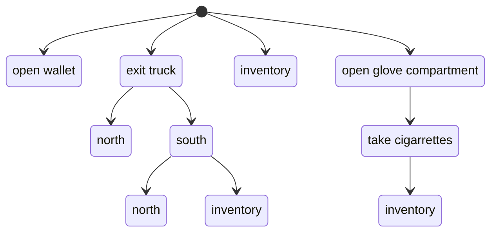

# The Skein

The Skein is a interactive tool used to run, debug, and test your projects.

> skein | skān |
> 
> noun
>
> a length of thread or yarn, loosely coiled and knotted.
> 
> a tangled or complicated arrangement, state, or situation: the skeins of her long hair | a skein of lies figurative.
> 
> a flock of wild geese or swans in flight, typically in a V-shaped formation.

At its most basic, the Skein is a web-based wrapper around the `dgdebug` command; you can enter
commands into the Skein, which are passed through to the running project, and the results are captured
and displayed back at you.

What's important is that the Skein _has a memory_.  As you enter commands, it saves all of those commands and responses in memory (and can later save its memory to a file).

In keeping with the name, each command/response is a called a "knot".

More importantly, you can "time travel" back to a prior knot and enter
a different command.  For example, here's a few different things you can do at the start of the game [Sanddancer](https://github.com/hlship/sanddancer-dialog):

It's important to note that each command has its own knot, even
if the same command exists elsewhere:  you'd expect a different
response to the `inventory` command at the very start of the game
than later, after you've gotten your cigarettes out of 
the glove box.

Likewise, moving around the world can be unexpected; not only are interactive fiction map layouts notoriously weird (you can't always go north after going south and end up in the same place) but your particular
project may have time based events, randomness, or wandering NPCs that change the world as you move about.

## Running the Skein

The simplest way to start is with `dgt new-skein`.  This will
start a specialized web server and open your web browser to the start of your project:

Let's break down the interface.

At the top of the Skein is the Knot Status; this is a counter of
all the knots in the Skein, broken into three categories:

* Green - knot's response matches blessed response
* Yellow - knot is new, with no blessed response
* Red - knot's response doesn't match blessed response

In this new Skein, there's only one knot so far and we haven't "blessed" that response, so it shows up yellow.

Each Knot may have a label, but this is optional; the *Jump* menu item makes it easy to jump to any labeled knot.

Each knot has popup of specific actions.

Eventually, knots will have children and you can navigate across different children of a knot with the child knots popup.

The text and border of the knot identifies its status.  The
text here is in bold blue, to indicate it is new and the border is yellow to indicate this is a new knot.

At the bottom of the Skein is a place to enter the next player command
and, floating at the bottom right, the floating action button; we'll come back to these later.

## Knot Actions

The root knot has very limited actions available:

The most important is _Bless_ which tells the Skein that the text for
the knot is correct.

If we click the Bless action the Skein will update:

Notice that the knot counts has changed to 1/0/0 ... one single knot whose response matches the expected content.  The knot's text is now plain, not bold blue, and the borders are grey.

## Entering New Commands

You can enter a command, such as `x lizard` in text field at the bottom to add a new child knot.

Child knots have more options than the root knot:

You can _Bless_ just this knot, or _Bless_ all knots from the root
to this knot.  We'll cover the remaining actions shortly.

## Replaying

The _Replay_ action will restart the session and run all the commands from the root to this knot.

This will check each response against the blessed response and identify any knots that have changed content.

After blessing the node, you can _Replay_ to check that everything is ok.

Let's say you were not happy with the phrasing of that last response and edited the source code:

You could then replay (the source changes will automatically be
picked up):

Now the knot is in error and the text shows deleted text (in red) and
added text (in blue).  If you are happy with this new text, you can bless the changes and continue.

## Replay All

Another option is _Replay All_ from the top navigation bar.
_Replay All_ will find every leaf knot in the Skein and replay it.

For large skeins, this can take a while, so there's a progress
dialog:

The above is from the Skein for Sanddancer.

Don't worry, with modern hardware, even replays of large games 
is incredibly fast. On my laptop, it takes under six seconds to replay all 50 leaves, and many of the leaf knots are dozens of player commands deep in the tree.  Do this all the time.

## Understanding Randomness

A project will often include some degree of randomness.

Your Dialog source may use predicates such as
`(select) ... (at random)` or `(random from $X to $Y into $Z)`.

You would think that replaying would cause all those random things to cause response mismatches, but they don't.

In Dialog, randomness is controlled by a _random number generator_.
An RNG is a special bit of code that returns a different
random number each time it is invoked.

However, you can set up an RNG with a _seed_ value.  In that case
it will return the same sequence of random numbers.  It's kind of like predestination.

But be warned; some changes to your source code may subtly shift the order in which different parts of Dialog consults the RNG, resulting in different random decisions.  That's why _Replay All_ should be run pretty frequently.

Likewise, there are actions that move or delete knots in the Skein; those will also affect randomness.

## Undo/Redo

Be fearless.  The Skein supports unlimited undo and redo.  These just juggle things in memory, Undo and Redo don't run commands or affect files.
