# The Skein

The Skein is a interactive tool used to run, debug, and test your projects. The Skein is designed to encourage an incremental, exploratory, gradual style of development ... it's a real step up from using `dgdebug` directly (or even `dgt debug`).

> skein | skān |
> 
> noun
>
> a length of thread or yarn, loosely coiled and knotted.
> 
> a tangled or complicated arrangement, state, or situation: the skeins of her long hair | a skein of lies figurative.
> 
> a flock of wild geese or swans in flight, typically in a V-shaped formation.

At its most basic, you can think of the Skein as a web-based wrapper around Dialog's debugger (`dgdebug`); you can enter
commands into the Skein, which are passed through to the running project, and the results are captured
and displayed back at you.

What's important is that the Skein _has a memory_.  As you enter player commands, it saves all of those commands and Dialog's responses in its memory (and can later save that memory to a file).

In keeping with the name, each command/response is a called a _knot_.

More importantly, while playing you can "time travel" back to a prior knot and enter
a different command.  For example, here's a few different things you can do at the start of the game [Sand-dancer](https://github.com/hlship/sanddancer-dialog):

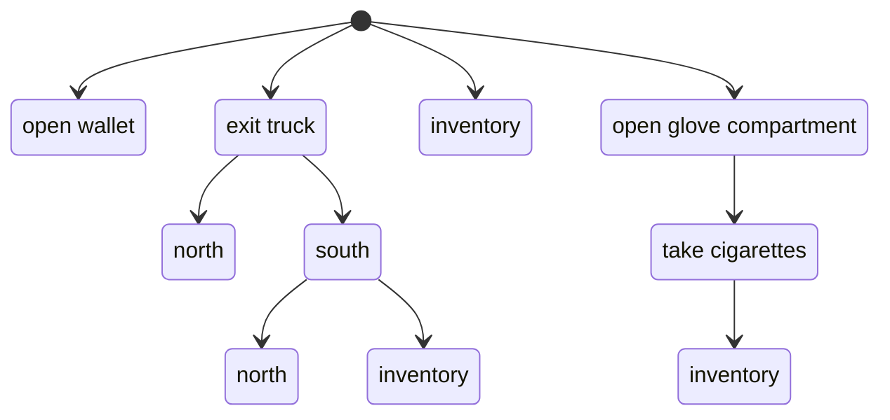

Perhaps you started initially by exiting the truck and moving south and taking inventory of
your belongings; then used the Skein to "time travel" back to the beginning and try a different route; 
say by opening the glove compartment.

No information is lost, the Skein remembers the entire, ever-growing tree of possibilities.

It's important to note that each command has its own knot, even
if the same command exists elsewhere in the Skein.
This makes sense if you think about it -- you'd expect a different
response to the `inventory` command at the very start of the game
than later, after you've gotten your cigarettes out of 
the glove box.

Likewise, even simple movement around the world's map can lead to the unexpected.  Not only are interactive fiction map layouts notoriously non-euclidian (you can't always go north after going south and end up in the same place) but your particular
project may have time based events, randomness, or wandering NPCs that change the world as you move about.  As they say, "no one steps into the same river twice."

## Running the Skein

The simplest way to start is with `dgt new-skein`.  This will
start a specialized web server and open your web browser to the start of your project:

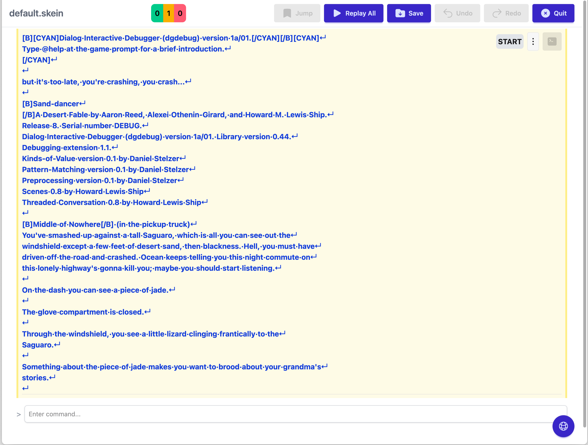

The above is an example of a new Skein for the Sand-dancer project.

Let's break down the interface.

>![WARNING]
> These screen shots have not been brought up to date with the recent changes that capture font and color
> information from the Dialog debugger.

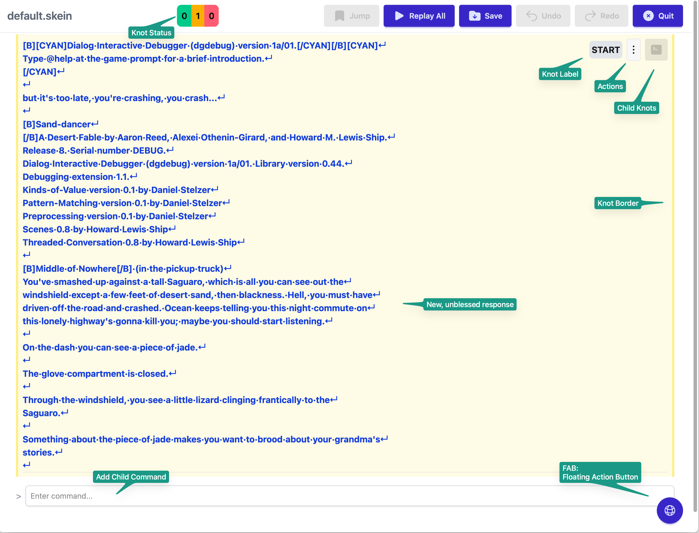

At the top of the Skein is the navigation bar.
It identifies the file name for this Skein,
the knot status,
and then a set of commands.

The  knot status is a count of
all the knots in the Skein, broken into three categories:

* Green (left) - knot's response is valid
* Yellow (middle) - knot is new
* Red (right) - knot's response is in error

The yellow and red badges are clickable when their count is non-zero; clicking a badge will jump to the next knot with that status, cycling through all matching knots on repeated clicks. This makes it easy to find and review new or errored knots in a large tree.

We'll loop back to this shortly to explain how the Skein knows which knots are valid or otherwise.

Each knot may have a label, but this is optional; the *Jump* menu item makes it easy to jump to any labeled knot.

Each knot has a button that raises a popup menu of knot-specific actions, and a second
button for a popup menu to navigate to child knots.

The text and border of the knot identifies its status.  The
text in the screenshot is in bold blue, to indicate it is new, and the knot's border is yellow to indicate this is a new knot.

At the bottom of the Skein is a place to enter the next player command
and, floating at the bottom right, the floating action button; we'll come back to these later.

## Knot Actions

The root knot has very limited actions available:

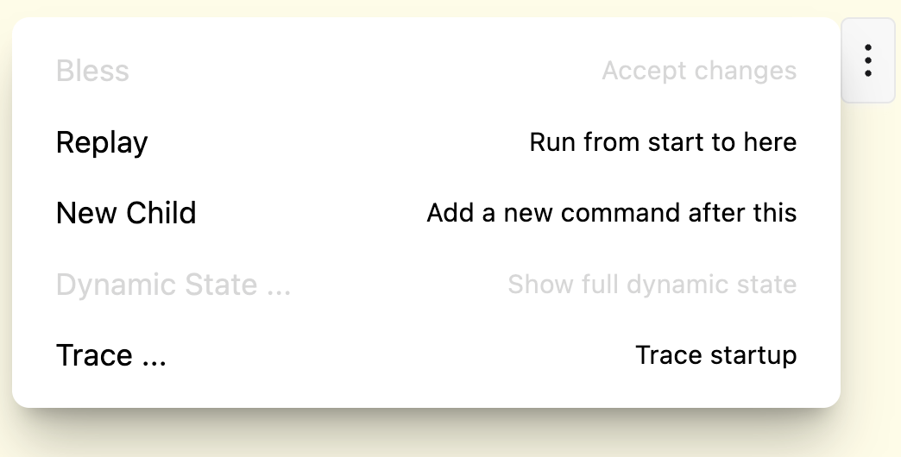

The most important action is _Bless_ which tells the Skein that the text for
the knot is correct.

The Skein stores the most recent response from the running project for each knot, but also an expected (or "blessed") response.  When these two values
align, the knot is valid; When they differ, the knot is in error.
when there is no blessed response yet, the knot is new.

If we click the _Bless_ action the Skein will update:

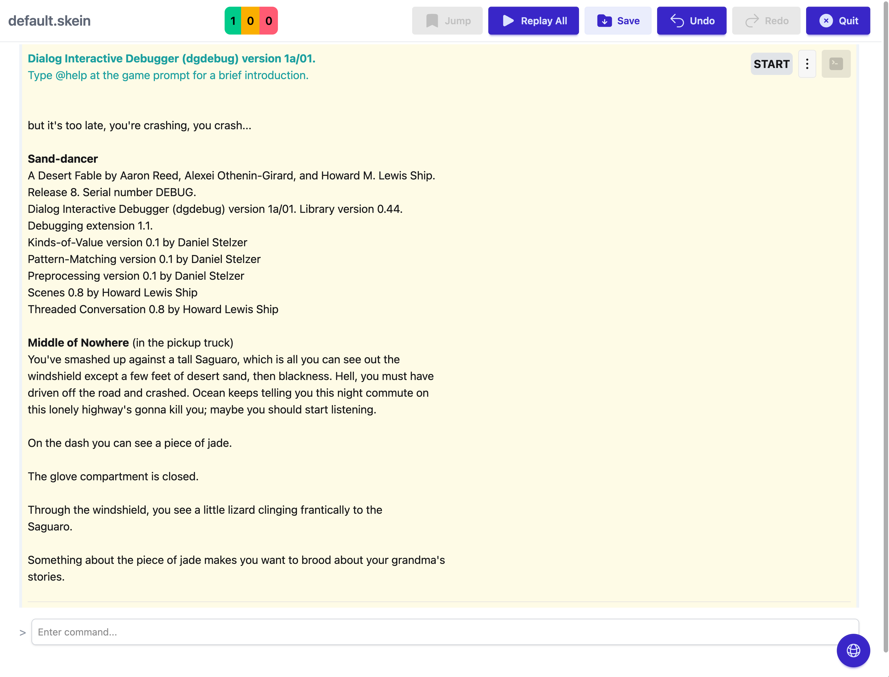

Notice that the knot counts in the navigation bar has changed to 1/0/0 ... one single knot whose response matches the expected response, no new knots, no knots in error.  The knot's text is now  in a plain font, not bold blue, and the knot's borders are grey.

## Entering New Commands

You can enter a command, such as `x lizard` in the text field at the bottom to add a new child knot.

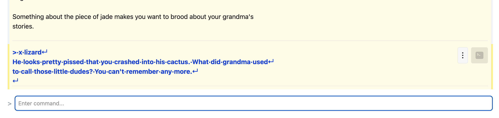

Child knots have more options than the root knot:

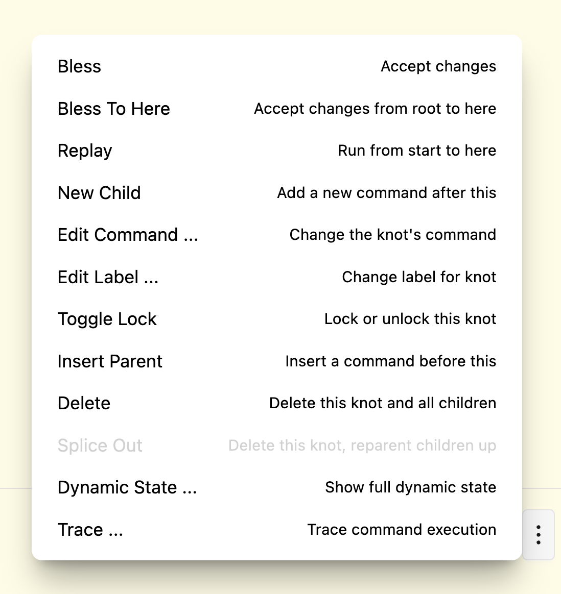

You can _Bless_ just this knot, or _Bless_ all knots from the root
to this knot.  We'll cover the remaining actions shortly.

## Replaying

The _Replay_ action will restart the debugger, and run all the commands from the root through to this knot.

Along the way, the Skein will check each response against the blessed response and identify any knots that have changed content.

After blessing the knot, you can _Replay_ to check that everything is still ok.

This is a critical part of development; you can change your project's source code -- anything from fixing a typo to reworking the logic of a puzzle -- and get immediate feedback if you broke anything.

Let's say you were not happy with the phrasing of that last response and edited the source code:

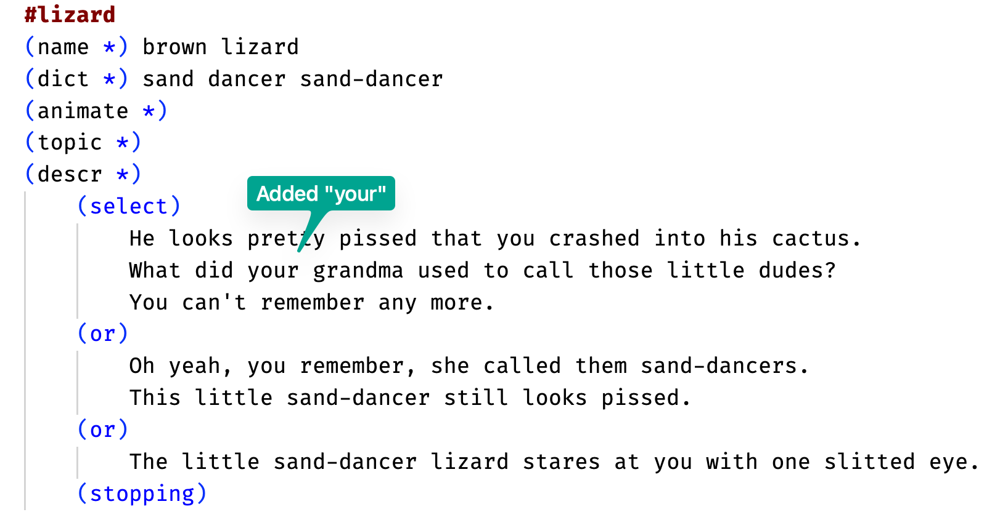

You could then replay (the source changes will automatically be
picked up):

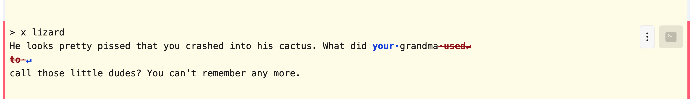

Now the knot is in error and the text shows deleted text (in red, with overstrike) and
added text (in blue).  If you are happy with this new text, you can bless the changes and continue.

## Replay All

Another option is the _Replay All_ command in the top navigation bar.
_Replay All_ will find every leaf knot in the Skein and replay it.

This is perhaps the Skein's greatest feature because it doesn't test just one path through the project, it tests _all_ paths. This is how you _really_ know that a change to your project's logic works, and hasn't had any unforseen consequences.

For large skeins, this replay process can take a few seconds, so there's a progress dialog:

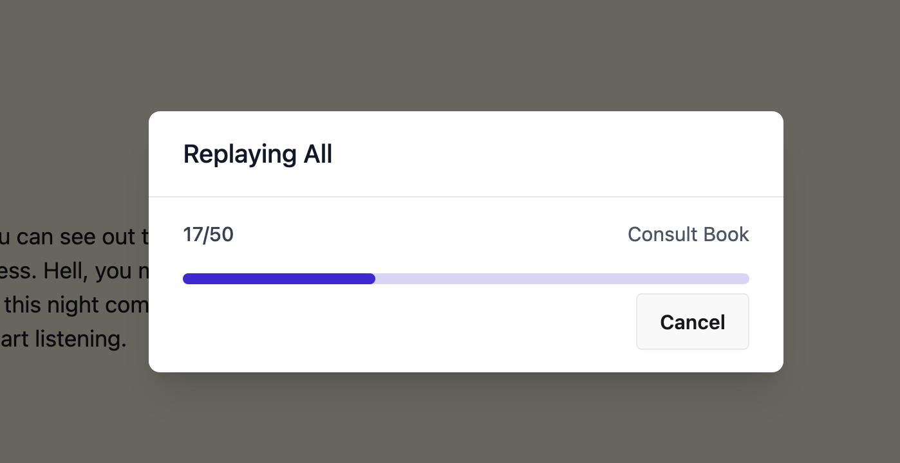

The above is from the Skein for Sand-dancer.

Don't worry, with modern hardware, even replays of large projects 
are ludicrously fast. On my laptop, it takes under six seconds to replay all 50 leaf knots in the Sand-dancer Skein, and many of these knots are dozens of player commands deep in the tree. 

## Understanding Randomness

A project will often include some degree of randomness.

Your Dialog source may use predicates such as
`(select) ... (at random)` or `(random from $X to $Y into $Z)` to vary the descriptions of rooms or objects, or the dialog of NPCs, or even the location of objects.

You would think that replaying a series of commands in the presence of such randomness would result in response mismatches, but fortunately they usually don't.

In Dialog, randomness is controlled by a _random number generator_.
An RNG is a special bit of code that returns a different
random number each time it is invoked.

An RNG is not truly random --  you can initialize an RNG with a numeric _seed_ value.  In that case
the RNG will return the same sequence of random numbers every time.  It's kind of like predestination.  Each Skein has its own seed value that is used whenever starting up the underlying `dgdebug` process.

But be warned; some changes to your source code may subtly shift the order in which different parts of Dialog consults the RNG, resulting in different random decisions.  That's why _Replay All_ should be run frequently, especially after any significant code changes.

Likewise, there are Skein actions that move or delete knots in the Skein; those will also affect randomness.

## Undo/Redo

Be fearless.  The Skein supports unlimited _Undo_ and _Redo_ (in the top navigation bar).  These commands only juggle things in memory, _Undo_ and _Redo_ don't run commands or affect files.  You can undo even after saving to a file.

For example, sometimes its easier to verify textual changes by using undo (to see how it used to look) then redo (to see how it now looks) before blessing the changes; this
is particularily useful when there's some subtle whitespace changes in the output.

## Saving

You can save your file at any time using the _Save_ command on the navigation bar.  

The Skein files are in a simple textual format; they are designed
to be managed files under source code control.

The `dgt test` command can be used, from the command line, to do the same work as _Replay All_ and verify that all possible Skein leaves are still valid.

## Beyond Player Commands

The text that you enter as a command is not limited to player commands for your project.  Just as with the Dialog debugger, you can enter
queries, multi-queries, and `(now)` expressions at the prompt and
those will execute as well.  This is often done to check the state of the world, or to set up complex situations for testing (though, when possible, it is better to do so through a series of player commands).

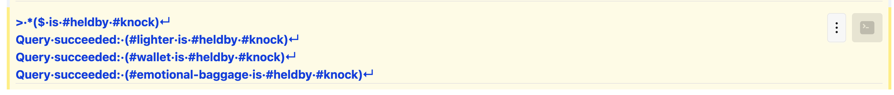

Also, it can be useful to put a transcript comment into your Skein; this is a player command that starts with an asterisk (`*`); the comment is ignored by Dialog and no predicates are executed.

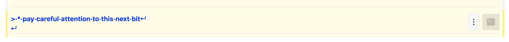

You can use a transcript comment to add a reminder about what you might be about to test in your Skein.

## Dynamic State

A Dialog project is fundamentally about parsing commands from the
player, matching those commands against specific rules implemented
as Dialog predicates, with the final outcome being a change to the dynamic state of the world, along with output describing those changes.  A Dialog project will reward the player when the commands, rules, and dynamic state project a consistent simulation of a world.

For example, the command `pick up the wrench` will, if successful, change the location and relation of the wrench to `(#wrench is #heldby #player)` and produce the text "You take the wrench."

The Skein tracks the dynamic state of the world after every command is executed.
Using the floating action button (the world icon, in the lower right), you can bring up a toggle switch to control if this information is shown:

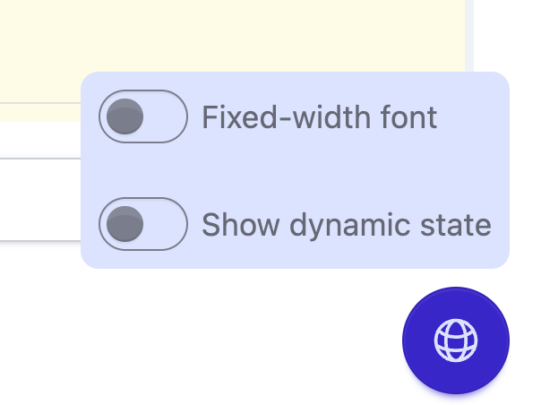

When this is toggled on, you will see a summary of _changed_ state after each command executes:

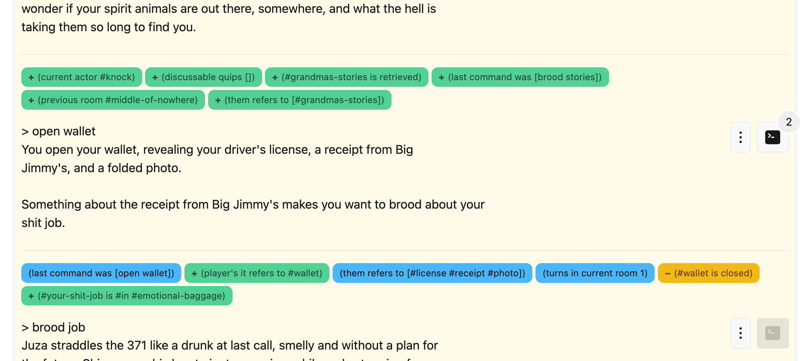

This is a mix of global flags, per-object flags, global
attributes, and per-object attributes.  Just the added, removed,
and changed predicates are displayed.

The Skein does something special with the dynamic state before
presenting it to you: it merges the `($ has relation $)` and `($ has parent $)` predicates together to form the
[access predicate](https://dialog-if.github.io/manual/dialog/0m03/lang/sugar.html#accesspred)
`($ is $ $)`; in other worlds, you just see `(#wrench is #heldby #player)` rather than `(#wrench has relation #heldby)` and
`(#wrench has parent #player)`.

This is a single, special, hard-coded case; the Skein does *not* support
the general case of access predicates.

In the knot's action menu, the `Dynamic State ...` item will bring up
a modal dialog of the dynamic state immediately after executing
the command, exactly as provided by the Dialog debugger.

It should be noted that compound player commands, such as `go north then take chalice`, are still treated by the Skein as a single command; there may be some intermediate dynamic state that is not exposed between the first part (`go north`) and the second (`take chalice`).

Dynamic state is **not** stored in the Skein file, or used as the basis for marking a knot as valid or in error; only the actual text response generated by Dialog is used for that purpose.

After loading the Skein, you should use the _Replay All_ command to collect all the dynamic state data.

## Time Travel

From any knot's action menu, the _New Child_ item will allow you to create a new child knot.  This will deselect any children of the knot, and move focus to the player command text field.

For example, in the below screenshot, the player opened the wallet and was hinted by the project to brood about their job.  Clicking on the action menu for the "open wallet" knot is how we time travel:

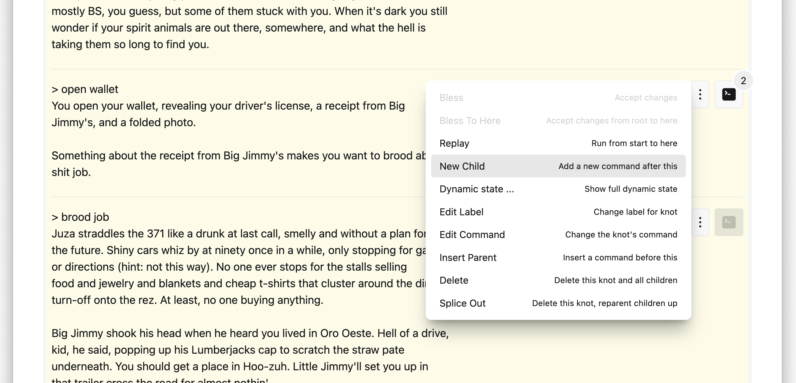

This will clear out the "brood job" command (it's still tracked by the Skein, just not selected for display); you can then enter a _different_ command to follow from "open wallet"; let's try "close wallet":

The new knot is marked as new (in yellow).  You will notice 
that the navigation menu button of
its parent knot ("open wallet") is now colored yellow, because
there is a new knot somewhere below it.  It also gets an indicator 
of the count of immediate
children of the parent; this indicator is only
displayed when there are two or more children.

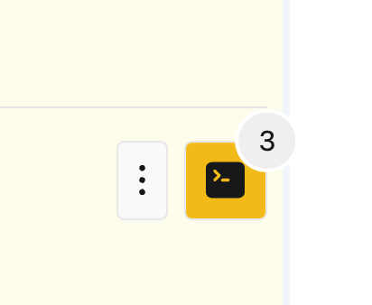

Those yellow navigation buttons will extend all the way up to the root knot.

This background color choice might be trumped by an invalid knot, resulting in navigation buttons being marked with a red background.

When the navigation button is clicked, the menu items
identify the state of the sub-tree as well:

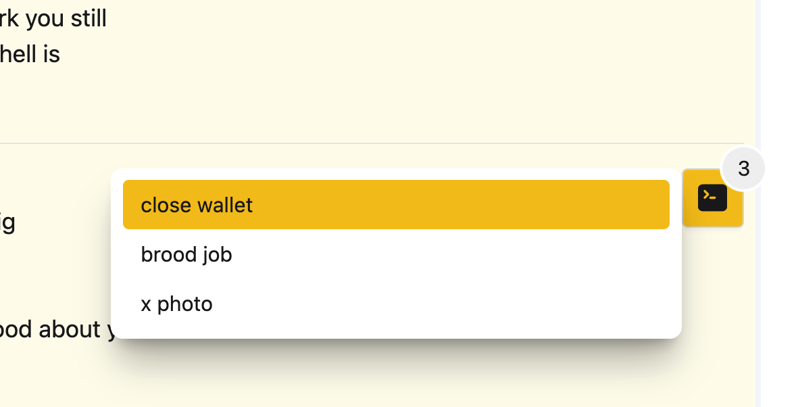

The menu item for the new knot is in yellow, because the indicated knot is new.  If you check out other navigation menus higher
in the Skein tree, you'll see that children are highlighted
if they are new (or in error) _or_ if some child or descendent
of the knot is new (or in error).

This menu item coloration is to assist you in navigating from the root down to the knot, or knots, that are new or in error.

## Engines

When you create a skein, you can optionally specify an _engine_.  
The default engine is `dgdebug`, but you can also use `frotz` or `frotz-release`.

The latter two run the Skein using the `frotz` command line tool instead of `dgdebug`.

When `frotz` is used, you will not see dynamic predicate data, as that requires the Dialog debugger. Likewise, you will not be able to enter queries or `(now)` expressions.

The `frotz` engine includes all debugging sources; `frotz-release` does not.  In both cases, the Skein will compile your sources into Z-code to run inside `frotz`,
recompiling as necessary when the source changes, as with the debugger.

There can be subtle differences between the debugger and the runtime, so having a playthrough using `frotz` or `frotz-release` may help uncover problems before your 
players do.  Remember that the `dgt test`  command will run _all_ the 
`.skein` files in the project directory, which is faster and easier than loading each one into the visual Skein.

## Limitations

The Skein has limitations, which are fundamentally based on
the fact that it treats the interaction as a series of commands and responses; some of Dialog's capabilities are outside this simple model.

* It can't help you with **status lines** as the debugger can't display those.
* It does not handle [non-command input](https://dialog-if.github.io/manual/dialog/1a01/lang/io.html#input)
* It doesn't allow for hyperlinks
