# The Skein

The Skein is a interactive tool used to run, debug, and test your projects. The Skein is designed to encourage an incremental, exploratory, gradual style of development ... it's a real step up from using `dgdebug` directly (or even `dgt debug`).

> skein | skān |
> 
> noun
>
> a length of thread or yarn, loosely coiled and knotted.
> 
> a tangled or complicated arrangement, state, or situation: the skeins of her long hair | a skein of lies figurative.
> 
> a flock of wild geese or swans in flight, typically in a V-shaped formation.

At its most basic, you can think of the Skein as a web-based wrapper around Dialog's debugger (`dgdebug`); you can enter
commands into the Skein, which are passed through to the running project, and the results are captured
and displayed back at you.

What's important is that the Skein _has a memory_.  As you enter player commands, it saves all of those commands and Dialog's responses in its memory (and can later save that memory to a file).

In keeping with the name, each command/response is a called a _knot_.

More importantly, while playing you can "time travel" back to a prior knot and enter
a different command.  For example, here's a few different things you can do at the start of the game [Sand-dancer](https://github.com/hlship/sanddancer-dialog):

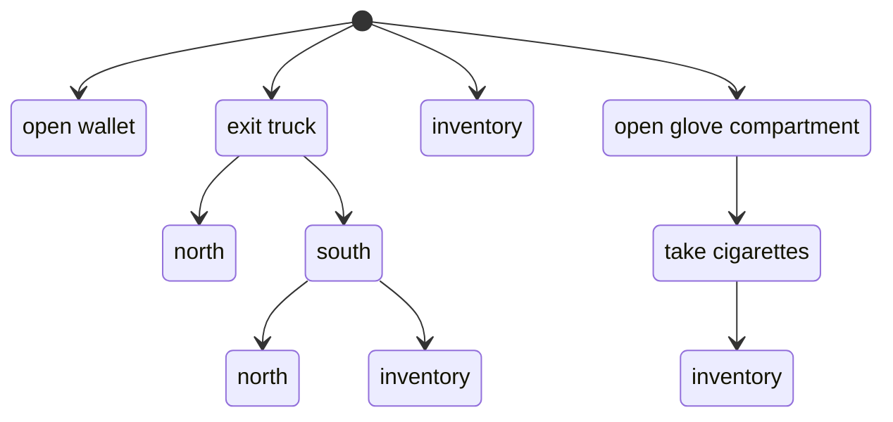
```mermaid
stateDiagram
  direction TB
  [*] --> openwallet
  [*] --> exittruck
  [*] --> i1
  [*] --> openglove
  exittruck --> n1
  exittruck --> s1
  s1 --> n2
  s1 --> i2
  openglove --> takecigs
  openwallet:open wallet
  exittruck:exit truck
  i1:inventory
  openglove:open glove compartment
  n1:north
  s1:south
  n2:north
  i2:inventory
  takecigs:take cigarettes
  takecigs --> i3
  i3: inventory
```

Perhaps you started initially by exiting the truck and moving south and taking inventory of
your belongings; then used the Skein to "time travel" back to the beginning and try a different route; 
say by opening the glove compartment.

No information is lost, the Skein remembers the entire, ever-growing tree of possibilities.

It's important to note that each command has its own knot, even
if the same command exists elsewhere in the Skein.
This makes sense if you think about it -- you'd expect a different
response to the `inventory` command at the very start of the game
than later, after you've gotten your cigarettes out of 
the glove box.

Likewise, even simple movement around the world's map can lead to the unexpected.  Not only are interactive fiction map layouts notoriously non-euclidian (you can't always go north after going south and end up in the same place) but your particular
project may have time based events, randomness, or wandering NPCs that change the world as you move about.  As they say, "no one steps into the same river twice."

## Running the Skein

The simplest way to start is with `dgt skein new`.  This will
start a specialized web server and open your web browser to the start of your project:

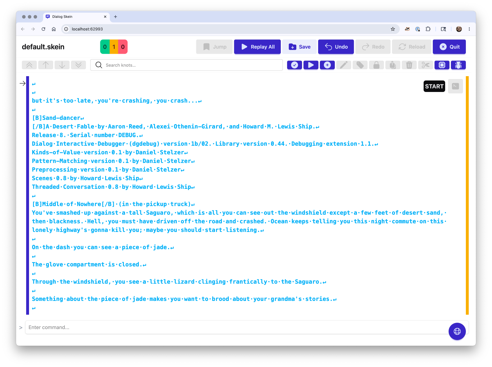

The above is an example of a new Skein for the Sand-dancer project.

Let's break down the interface.

From top to bottom / left to right:

* The main toolbar, with commands that affect the entire Skein
* The active knot toolbar, with navigation, search, and operations on the _active_ knot
* **Left panel:** The nav graph — a scrollable tree showing every knot and their relationships
* **Right panel:** The transcript, showing a series of player commands and game responses in a linear sequence
* A command entry field to enter the next command
* In the bottom right: the Floating Action Button, which provides some power tools

The two panels are separated by a drag handle; pull it left or right to resize.

You can mouse over the toolbar buttons for a reminder of what they do and what accelerator keys can be used instead.

The Skein is designed to work very efficiently with just keyboard, no mouse.

## Transcript

The Transcript is broken into knots - each showing a player command and the project's response - forming a series 
of interactions from the START knot to the end.

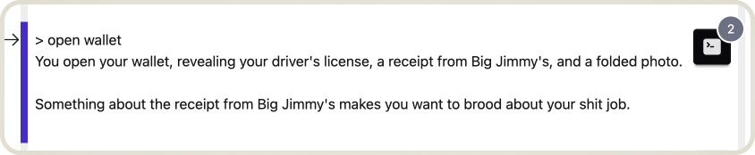

One knot is the _active_ knot; it gets a blue left border (instead of grey, yellow, or red) and an arrow.
The other colors indicate that the knot's response is new (yellow), or doesn't match the recorded response (red).

In the overview image, the knot is a _new_ knot, because it is a fresh skein.  The text is output in a fixed width
font, with visible whitespace. The right border is in yellow, to mark it as new.  Later we'll see what a knot looks
like when it contains an error.

This knot, for the command "open wallet", is in the valid state: the most recent replay output matches what's stored in
the Skein. 

Most of the time, each knot has just one child knot; in some cases, a knot may be a branching point, with two or more
children. The child navigation button identifies the number of children.  Clicking on the button raises a popup
to select between those children:

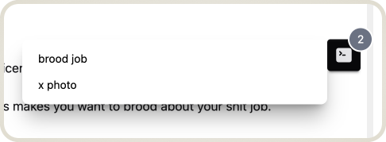

Later we'll see how to give knots labels, and lock them against accidental deletion; this appears next to the
navigation button:

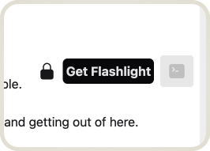

## Nav Graph

The nav graph on the left shows the full tree of all knots, arranged as a top-down tree with arrows connecting each knot to its children.

> **Screenshot needed:** skein-nav-graph.png — the nav graph pane showing a tree with several branches, the active spine highlighted, and some error/new tinting on ancestors.

The _spine_ is the set of nodes in the nav graph that correspond to what is currently shown in the transcript — the path from root down to the active knot.

### Node colours

Each node pill is colour-coded to communicate status at a glance:

| Colour | Meaning |
|--------|---------|
| Primary blue (full) | Active knot |
| Primary blue (lighter) | On the spine (matches the transcript) |
| Neutral grey | Off-spine, no issues |
| Warning yellow (full) | This knot is **new** (no blessed response yet) |
| Warning yellow (faded) | This knot is ok, but has a **new** descendant somewhere below it |
| Error red (full) | This knot is in **error** |
| Error red (faded) | This knot is ok, but has an **error** descendant somewhere below it |

The faded ancestor tinting makes it easy to spot, at a glance, which branches contain new or broken knots — without needing to expand every subtree.

### Navigation

Clicking a node in the nav graph makes it the active knot and updates the transcript to show the path through that node.  When navigating to a node with a single chain of descendants, the Skein automatically selects down through the chain until it reaches a leaf or a branching point.

Siblings are displayed in alphabetical order by command.

### Expand and collapse

Nodes with children show a small ▾/▸ toggle below them.  Click it to collapse or expand that subtree.  Spine nodes (on the path to the active knot) are always shown; only off-spine branches can be collapsed.

The **Toggle Expand** button (⌥X) in the operations toolbar expands or collapses the active knot's subtree.

### Resizing

Drag the handle between the nav graph and the transcript to resize the panels.

## Toolbar

At the top of the screen is the main toolbar; it contains operations that affects the entire Skein.

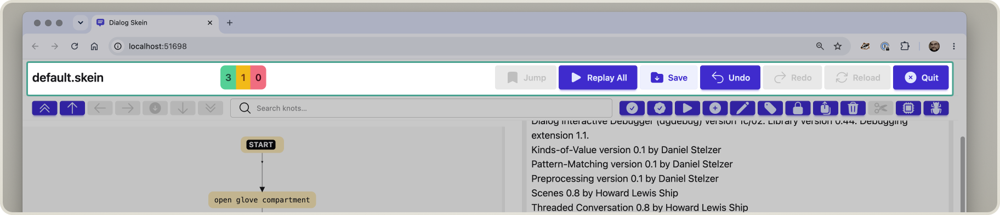

The main toolbar identifies, across the top, the path to the Skein file, the knot status, and then a series of command buttons.

The  knot status is a count of
all the knots in the Skein, broken into three categories:

* Green (left) - knot's response is valid
* Yellow (middle) - knot is new
* Red (right) - knot's response is in error

The yellow and red badges are clickable when their count is non-zero; clicking a badge will jump to the next knot with that status, cycling through all matching knots on repeated clicks. This makes it easy to find and review new or errored knots in a large tree.

We'll loop back to this shortly to explain how the Skein knows which knots are valid or otherwise.

The other buttons are self-explanatory:

* Replay All will be discussed below (but it's important!)
* Undo and Redo work as you'd expect; the Undo is effectively unlimited
* Reload reloads the Skein from the file - useful if you've made changes there (for example, rolling back changes as a Git operation)
* Quit will cause `dgt` to exit - but you are given a chance to save the Skein before exiting, if it has changes.

You can even undo and redo past a reload.

## Active Knot and Operations Toolbar

Below the main toolbar is the operations tool bar.

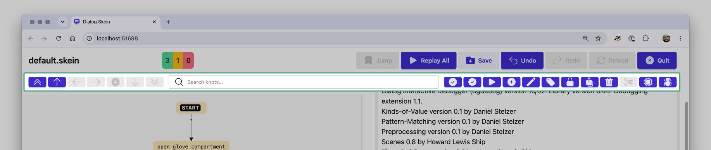

The Skein is organized such that there is always one selected _leaf_ (a knot with no further commands after it), and forms
a transcript of that particular run through the project.  However, the Skein tracks _all_ the different paths that have been recorded.

Clicking any knot makes it the _active knot_, highlighted with a blue left border and a ▶ marker in the left gutter.  All operations in the secondary toolbar below the navigation bar apply to the active knot.

In addition, the search bar is also in the operation bar.

The secondary toolbar has two groups of buttons:

**Left side — navigation:**  Buttons navigate between knots in the currently visible path and across siblings.

| Button | Action                               | Shortcut |
|--------|--------------------------------------|----------|
| ⏫ | First Knot — scroll to START knot    | ⌥⇧↑ |
| ↑ | Parent Knot                          | ⌥↑ |
| ← | Previous Sibling                     | ⌥← |
| → | Next Sibling                         | ⌥→ |
| ⊙ | Toggle Expand (nav graph)            | ⌥X |
| ↓ | Child Knot                           | ⌥↓ |
| ⏬ | Last Knot — scroll to leaf           | ⌥⇧↓ |

Whenever the last knot is the active knot, the command input field will receive focus and be scrolled into view.

The sibling navigation buttons (⌥←/⌥→) move to the previous or next sibling of the active knot, sorted alphabetically.  The transcript spine updates to reflect the new path.

**Right side — operations** applied to the active knot:

| Button | Action                                                  | Shortcut |
|--------|---------------------------------------------------------|----------|
| ✓ | Bless Knot — accept the active knot's changes only      | ⌥B |
| ✓ | Bless Changes — accept all visible changes to the leaf  | ⌥⇧B |
| ▶ | Replay to this knot                                     | ⌥R |
| + | New Child — prepare to add a command here               | ⌥A |
| ✏ | Edit Command…                                           | ⌥E |
| 🏷 | Edit Label…                                             | ⌥L |
| 🔒 | Toggle Lock                                             | ⌥K |
| ⤴ | Insert Parent…                                          | ⌥I |
| 🗑 | Delete                                                  | ⌥D |
| ✂ | Splice Out                                              | |

When the active knot is the root, all operations that do not apply to the root are disabled (rather than hidden) so the toolbar layout stays stable.

When running with the `dgdebug` engine, two additional buttons appear:

| Button | Action           | Shortcut |
|--------|------------------|----------|
| 🖥 | Dynamic State… | ⌥S |
| 🐛 | Trace…         | ⌥T |

The two most important actions are _Bless Knot_ and _Bless Changes_.  _Bless Knot_ (⌥B) accepts the response of just the active knot.  _Bless Changes_ (⌥⇧B) accepts all changes from the root through to the visible leaf knot.

The Skein stores the most recent response from the running project for each knot, but also an expected (or "blessed") response.  When these two values
align, the knot is valid; When they differ, the knot is in error.
when there is no blessed response yet, the knot is new.

Unblessed text is always shown in a fixed width font; certain styling (such as color and font weight) is identified with bracket delimiters (the `[CYAN]` and `[B]` markers). Further, in changed text,
whitespace is made visible.

If we click the _Bless_ action the Skein will update:

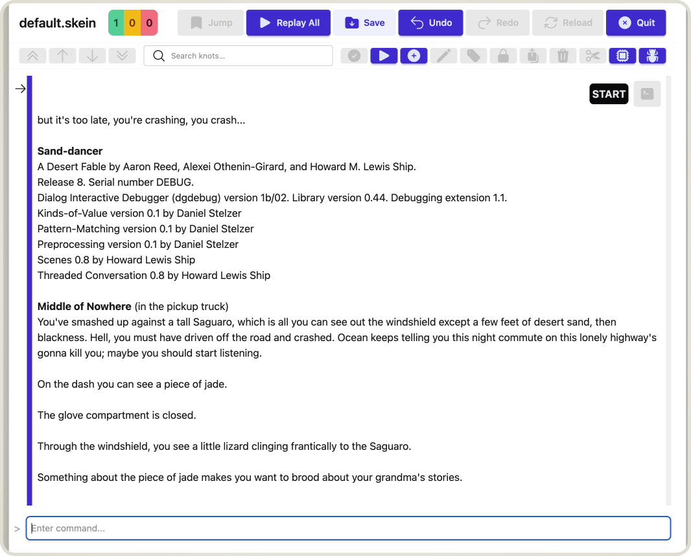

Now the special markers for fonts are gone.

Notice that the knot counts in the toolbar have changed to 1/0/0 ... one single knot whose response matches the expected response, no new knots, no knots in error.  The knot's text is now  in a plain font, not bold blue, and the knot's right border is gray.

The font, by default, reverts to proportional, which is appropriate for most projects.

## Entering New Commands

You can enter a command, such as `x lizard` in the text field at the bottom to add a new child knot.

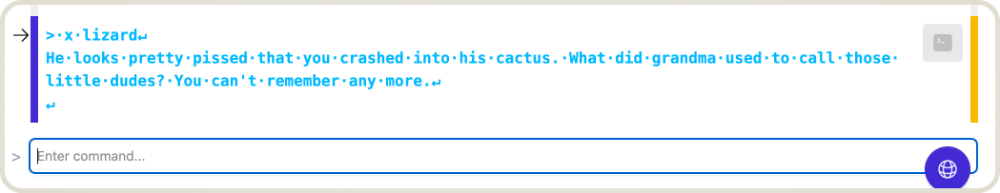

You can enter a series of commands, and if the responses are to your liking, bless them as a single operation with ⌥⇧B
(or by clicking the Bless Changes icon), or bless just the active knot with ⌥B.

## Searching

Use ⌘F to enter the search field; this is a fast search of all the content in the skein.

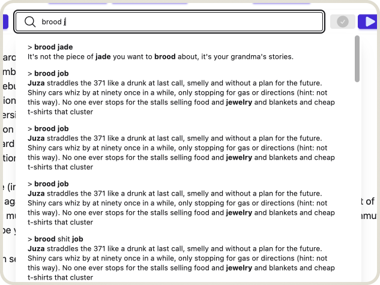

From within the search text field, you can hit the down arrow to select the different matches, and hit enter to 
select that knot as the active knot.

You can hit escape to return to the search text field, and escape again to clear the search text.

## Replaying

The _Replay_ action will restart the debugger, and run all the commands from the root through to the active knot.

Along the way, the Skein will check each response against the blessed response and identify any knots that have changed content.

After blessing the knot, you can _Replay_ to check that everything is still ok.

This is a critical part of development; you can change your project's source code -- anything from fixing a typo to reworking the logic of a puzzle -- and get immediate feedback if you broke anything.

Let's say you were not happy with the phrasing of that last response and edited the source code:

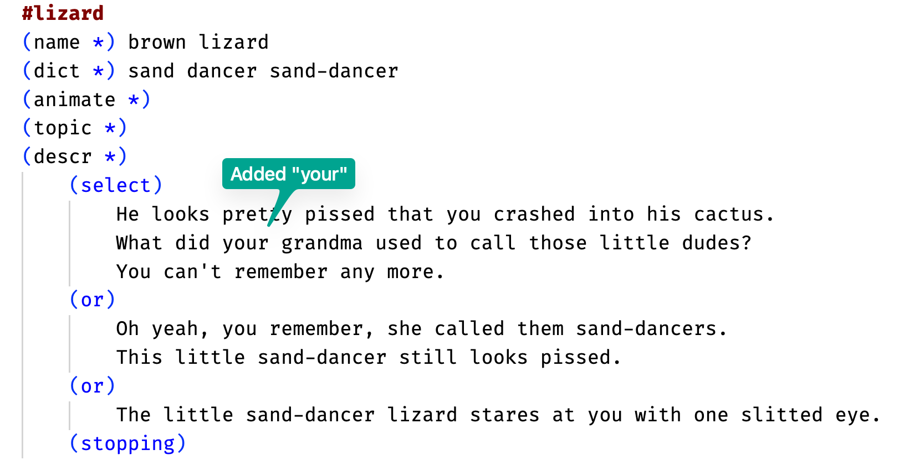

You could then replay (the source changes will automatically be
picked up):

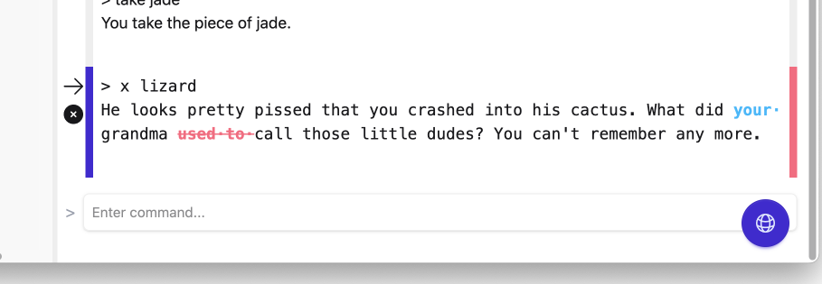

The knot is now in error:  The Skein displays
the new response in fixed width; it identifies
the changed text:  red text for deleted,
blue text for added, and white space in changed
sections is made visible.

Further, all the navigation buttons of prior knots leading up to this knot have changed color to indicate the path from
the START knot to the error.

Remember that you can also click the error count in the knot status at the top of the page to cycle through knots that are
in error.

Now that you can identify the changes, you can decide whether to bless them, or change the source and replay the knot again.

## Replay All

Another option is the _Replay All_ command in the top navigation bar.
_Replay All_ will find every leaf knot in the Skein and replay it.

This is perhaps the Skein's greatest feature because it doesn't test just one path through the project, it tests _all_ paths. This is how you _really_ know that a change to your project's logic works, and hasn't had any unforseen consequences.

For large skeins, this replay process can take a few seconds, so there's a progress dialog:

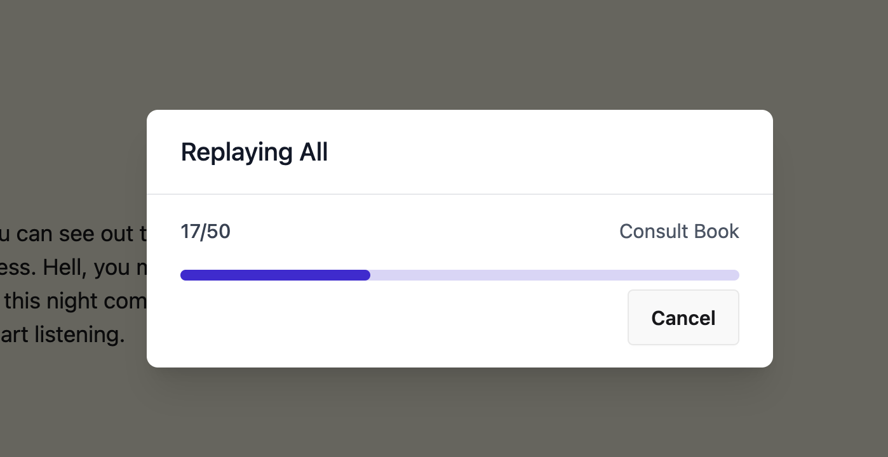

The above is from the Skein for Sand-dancer.

Don't worry, with modern hardware, even replays of large projects are ludicrously fast. Replay All runs all leaf knots in parallel, so wall-clock time is limited by the longest single path rather than the total number of knots.  On a laptop, replaying all 50 leaf knots in the Sand-dancer Skein takes well under six seconds, and many of those knots are dozens of player commands deep in the tree.

## Understanding Randomness

A project will often include some degree of randomness.

Your Dialog source may use predicates such as
`(select) ... (at random)` or `(random from $X to $Y into $Z)` to vary the descriptions of rooms or objects, or the dialog of NPCs, or even the location of objects.

You would think that replaying a series of commands in the presence of such randomness would result in response mismatches, but fortunately they usually don't.

In Dialog, randomness is controlled by a _random number generator_.
An RNG is a special bit of code that returns a different
random number each time it is invoked.

An RNG is not truly random --  you can initialize an RNG with a numeric _seed_ value.  In that case
the RNG will return the same sequence of random numbers every time.  It's kind of like predestination.  Each Skein has its own seed value that is used whenever starting up the underlying `dgdebug` process.

But be warned; some changes to your source code may subtly shift the order in which different parts of Dialog consults the RNG, resulting in different random decisions.  That's why _Replay All_ should be run frequently, especially after any significant code changes.

Likewise, there are Skein actions that move or delete knots in the Skein; those will also affect randomness.

## Undo/Redo

Be fearless.  The Skein supports unlimited _Undo_ and _Redo_ (in the top navigation bar).  These commands only juggle things in memory, _Undo_ and _Redo_ don't run commands or affect files.  You can undo even after saving to a file or reloading from a file.

For example, sometimes its easier to verify textual changes by using undo (to see how it used to look) then redo (to see how it now looks) before blessing the changes; this
is particularly useful when there's some subtle whitespace changes in the output.

## Saving

You can save your file at any time using the _Save_ command on the navigation bar.  

The Skein files are in a simple textual format; they are designed
to be managed files under source code control.

The `dgt skein test` command can be used, from the command line, to do the same work as _Replay All_ and verify that all possible Skein leaves are still valid.

## Keyboard Shortcuts

All toolbar buttons show their shortcut in a tooltip on hover.  Shortcuts are suppressed when a modal dialog is open, and ignored when the button is disabled.

Most operation shortcuts use ⌥ (Option) on Mac or Alt on Windows/Linux; a few use ⌘ (Cmd) on Mac or Ctrl on Windows/Linux.

### Navigation bar

| Shortcut | Action     |
|----------|------------|
| ⌥⇧R      | Replay All |
| ⌘S       | Save       |
| ⌘Z       | Undo       |
| ⌘⇧Z      | Redo       |
| ⌘F       | Search     |
| ⌥J       | Jump (open labeled-knot dropdown) |

### Operations toolbar — knot navigation

| Shortcut | Action                                          |
|----------|-------------------------------------------------|
| ⌥⇧↑      | First Knot (scroll to root)                     |
| ⌥↑       | Parent Knot                                     |
| ⌥←       | Previous Sibling (alphabetical order)           |
| ⌥→       | Next Sibling (alphabetical order)               |
| ⌥X       | Toggle Expand (nav graph)                       |
| ⌥↓       | Child Knot                                      |
| ⌥⇧↓      | Last Knot (scroll to leaf, focus command input) |

### Operations toolbar — knot operations

| Shortcut | Action                        |
|----------|-------------------------------|
| ⌥B       | Bless Knot (active knot only) |
| ⌥⇧B      | Bless Changes (to leaf)       |
| ⌥R       | Replay to active knot         |
| ⌥A       | New Child                     |
| ⌥E       | Edit Command                  |
| ⌥I       | Insert Parent…                |
| ⌥L       | Edit Label                    |
| ⌥K       | Toggle Lock                   |
| ⌥D       | Delete                        |

## Beyond Player Commands

The text that you enter as a command is not limited to player commands for your project.  Just as with the Dialog debugger, you can enter
queries, multi-queries, and `(now)` expressions at the prompt and
those will execute as well.  This is often done to check the state of the world, or to set up complex situations for testing (though, when possible, it is better to do so through a series of player commands).

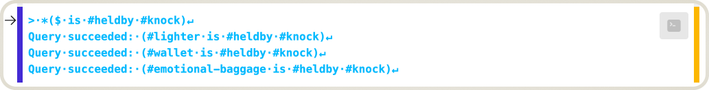

Also, it can be useful to put a transcript comment into your Skein; this is a player command that starts with an asterisk (`*`); the comment is ignored by Dialog and no predicates are executed.

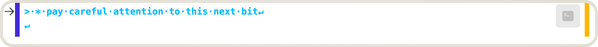

You can use a transcript comment to add a reminder about what you might be about to test in your Skein.

## Dynamic State

A Dialog project is fundamentally about parsing commands from the
player, matching those commands against specific rules implemented
as Dialog predicates, with the final outcome being a change to the dynamic state of the world, along with output describing those changes.  A Dialog project will reward the player when the commands, rules, and dynamic state project a consistent simulation of a world.

For example, the command `pick up the wrench` will, if successful, change the location and relation of the wrench to `(#wrench is #heldby #player)` and produce the text "You take the wrench."

The Skein tracks the dynamic state of the world after every command is executed.
Using the floating action button (the world icon, in the lower right), you can bring up a toggle switch to control if this information is shown:

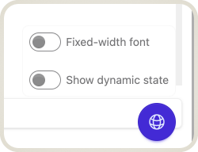

When this is toggled on, you will see a summary of _changed_ state after each command executes:

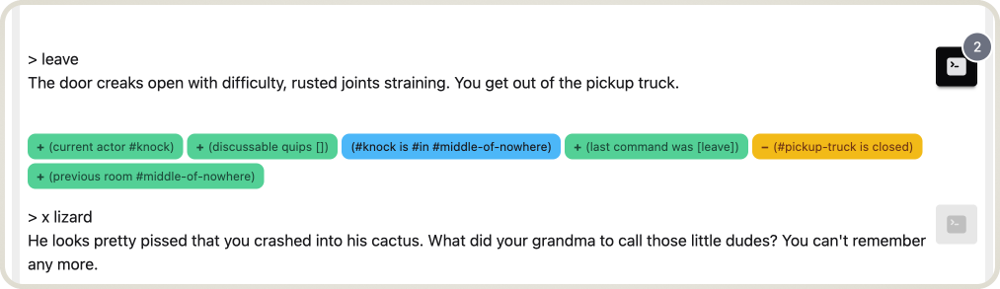

This is a mix of global flags, per-object flags, global
attributes, and per-object attributes.  Just the added, removed,
and changed predicates are displayed.

The Skein does something special with the dynamic state before
presenting it to you: it merges the `($ has relation $)` and `($ has parent $)` predicates together to form the
[access predicate](https://dialog-if.github.io/manual/dialog/0m03/lang/sugar.html#accesspred)
`($ is $ $)`; in other worlds, you just see `(#wrench is #heldby #player)` rather than `(#wrench has relation #heldby)` and
`(#wrench has parent #player)`.

This is a single, special, hard-coded case; the Skein does *not* support
the general case of access predicates.

In the knot's action menu, the `Dynamic State ...` item will bring up
a modal dialog of the dynamic state immediately after executing
the command, exactly as provided by the Dialog debugger.

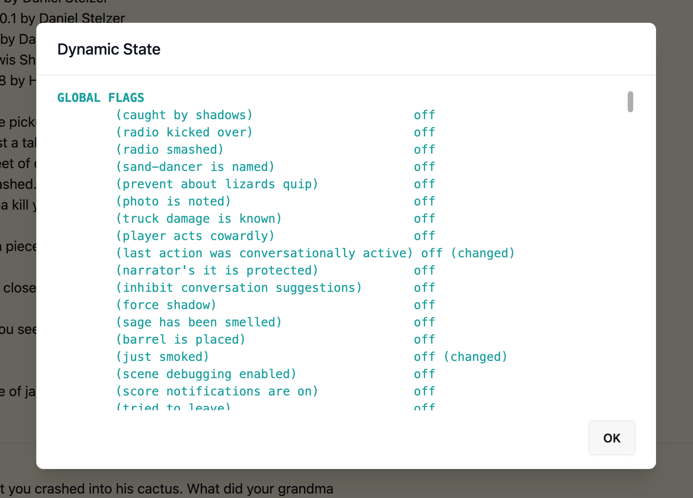

It should be noted that compound player commands, such as `go north then take chalice`, are still treated by the Skein as a single command; there may be some intermediate dynamic state that is not exposed between the first part (`go north`) and the second (`take chalice`).

Dynamic state is **not** stored in the Skein file, or used as the basis for marking a knot as valid or in error; only the actual text response generated by Dialog is used for that purpose.

After loading the Skein, you should use the _Replay All_ command to collect all the dynamic state data.

## Tracing

When running with the `dgdebug` engine, you can trace the execution of any command.
This is useful for understanding how Dialog processes a command: which predicates are queried,
which succeed or fail, and the full call hierarchy.

From a knot's action menu, the _Trace ..._ item will replay to
the knot's parent and then execute the knot's command with the
Dialog debugger's trace mode enabled. The results are displayed in a
modal dialog:

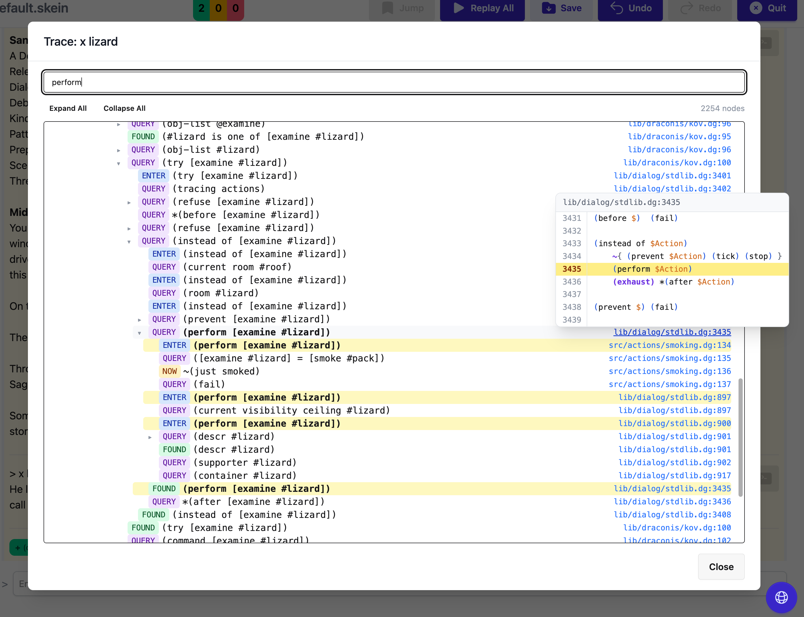

The trace modal shows a tree of trace events, each tagged with one of four types:

| Type   | Meaning                                                  |
|--------|----------------------------------------------------------|
| ENTER  | A predicate is being entered (a new rule is being tried) |
| QUERY  | A sub-predicate is being queried                         |
| FOUND  | A predicate or query succeeded                           |
| NOW    | A dynamic predicate is being updated via `(now)`         |

Each node shows the predicate and the source file location (file and line number).
The source location is a link; clicking it opens the source file in a new browser tab,
with line numbers displayed and the referenced line highlighted and scrolled into view.

Hovering over a source link for a short time displays a floating preview popup showing
a few lines of source context around the referenced line, with the target line highlighted.
This lets you quickly glance at the source without leaving the trace view.

Nodes with children can be expanded or collapsed by clicking the arrow toggle.

The _Expand All_ and _Collapse All_ buttons control the entire tree at once.

### Searching

The search field at the top of the trace modal lets you search for predicates
or source file names (case-insensitive).  When you type a search term, the tree
automatically expands to reveal all matching nodes, which are highlighted with a yellow background.

Clearing the search field collapses the tree back.

### Finding

If you enter text into the search field and hit enter, the tree display will select a node
matching the text and scroll that into view.  Terms like `before`, `instead of`, or `perform` are
particularly handy for skipping the considerable amount of rules that simply attempt to 
understand the player's command before an action is identified.

## Time Travel

To time-travel, click a knot to make it the active knot, then click the _New Child_ button (⌥A) in the operations toolbar.  This will deselect any children of the knot and move focus to the player command text field at the bottom.

For example, in the below screenshot, the player opened the wallet and was hinted by the project to brood about their job.  Clicking on the "open wallet" knot and then _New Child_ is how we time travel:

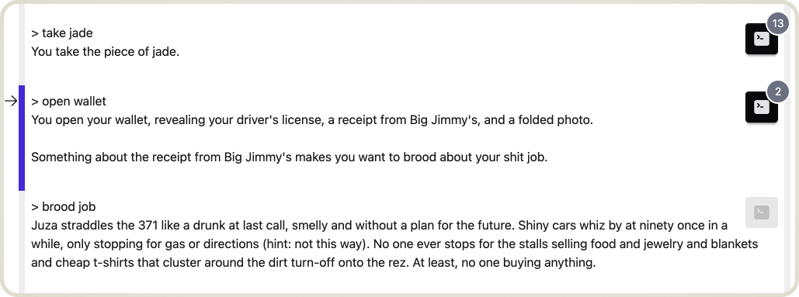

This will clear out the "brood job" command (it's still tracked by the Skein, just not selected for display); you can then enter a _different_ command to follow from "open wallet"; let's try "close wallet":

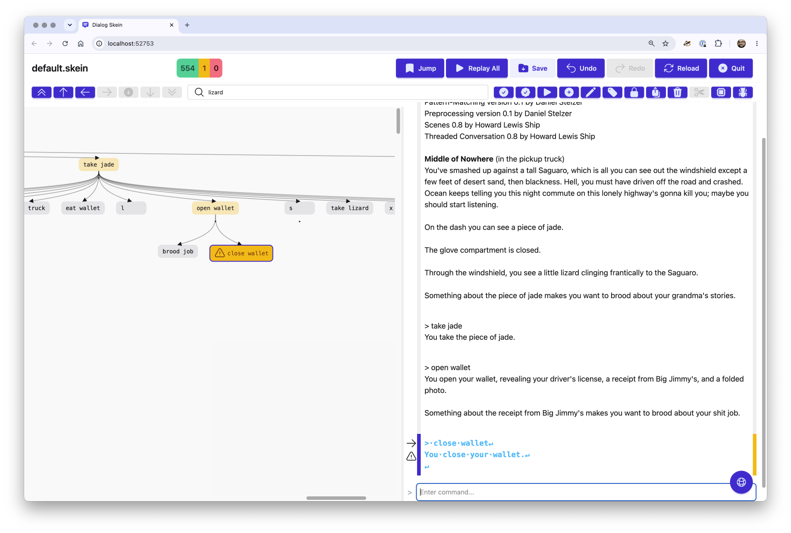

The new knot is marked as new (in yellow).  You will notice 
that the navigation menu button of
its parent knot ("open wallet") is now colored yellow, because
there is a new knot somewhere below it.  It also gets an indicator 
of the count of immediate
children of the parent; this indicator is only
displayed when there are two or more children.

Those yellow navigation buttons will extend all the way up to the root knot.

This background color choice might be trumped by an invalid knot, resulting in navigation buttons being marked with a red background.

When the navigation button is clicked, the menu items
identify the state of the sub-tree as well:

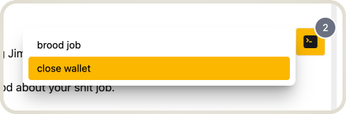

The menu item for the new knot is in yellow, because the indicated knot is new.  If you check out other navigation menus higher
in the Skein tree, you'll see that children are highlighted
if they are new (or in error) _or_ if some child or descendent
of the knot is new (or in error).

This menu item coloration is to assist you in navigating from the root down to the knot, or knots, that are new or in error.

## Reloading

In your `dialog.edn`, you will typically specify directories whose files are part of your project.
The Skein is smarter than `dgdebug` here, because it will detect when files are added, deleted, or
renamed in these directories and re-run `dgdebug` with the updated source files list, automatically.

The Skein also notices changes to `dialog.edn` itself.

Because of this, you can keep the Skein running even when modifying your source files and source
directories and the Skein will just keep up.  But don't forget to `Replay All` after such changes!

## Source Errors

You may occasionally enter a source error while you are in your code/test/replay loop.

This will be noticed by the Skein:

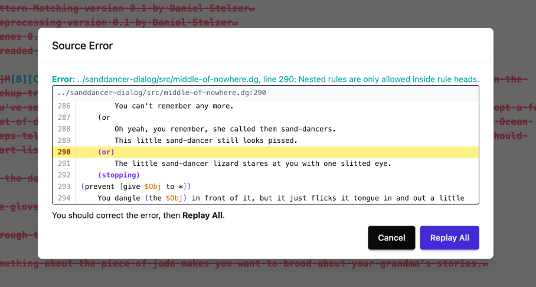

Here, I accidentally deleted the closing parenthesis on line 287; Dialog figured it out on line 290.

You can make corrections and then dismiss the modal, or directly replay all knots (the latter is advised).

## Engines

When you create a skein, you can optionally specify an _engine_.  
The default engine is `dgdebug`, but you can also use `frotz` or `frotz-release`.

The latter two run the Skein using the `frotz` command line tool instead of `dgdebug`.

When `frotz` is used, you will not see dynamic predicate data, as that requires the Dialog debugger. Likewise, you will not be able to enter queries or `(now)` expressions, and command tracing is not available.

The `frotz` engine includes all debugging sources; `frotz-release` does not.  In both cases, the Skein will compile your sources into Z-code to run inside `frotz`,
recompiling as necessary when the source changes, as with the debugger.

There can be subtle differences between the debugger and the runtime, so having a playthrough using `frotz` or `frotz-release` may help uncover problems before your 
players do.  Remember that the `dgt skein test`  command will run _all_ the
`.skein` files in the project directory, which is faster and easier than loading each one into the visual Skein.

## Dark Mode

The Skein automatically follows your operating system's light/dark mode preference.  All UI elements — knot backgrounds, toolbars, modals, tooltips, and status badges — adapt to the active theme.

> **Screenshot needed:** skein-dark-mode.png — the Skein in dark mode, showing the toolbar, a mix of knot statuses, and the active knot highlighted.

A few elements are intentionally kept light regardless of theme for legibility:

* **Tooltips** — white background with black text in all themes
* **Source preview popups** — white background, since the syntax highlighting colours assume a light canvas
* **Knot labels** — use a neutral grey badge (`btn-neutral` style) that reads well in both modes

## Limitations

The Skein has limitations, which are fundamentally based on
the fact that it treats the interaction as a series of commands and responses; some of Dialog's capabilities are outside this simple model.

* It can't help you with **status lines** as the debugger can't display those
* It does not (yet!) handle [non-command input](https://dialog-if.github.io/manual/dialog/1a01/lang/io.html#input)
* It doesn't allow for hyperlinks
* Neither `dgdebug` nor `dfrotz` honors colors specified in style classes
